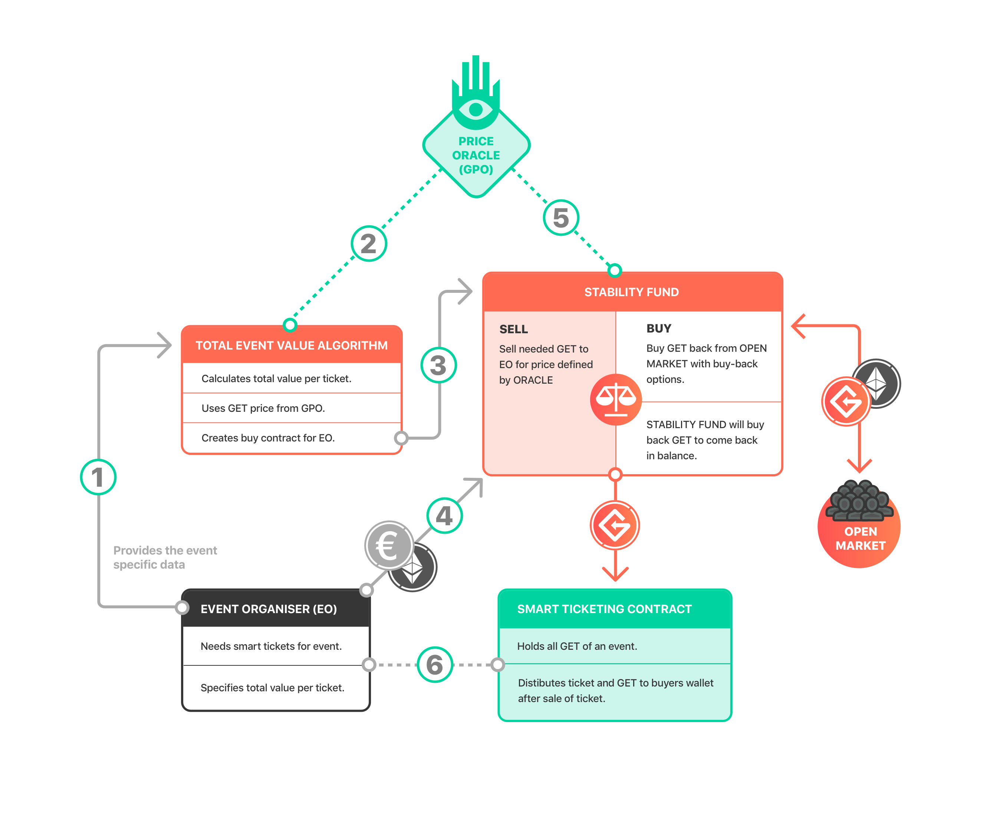

# 3.10 Guarenteed exchange rate

The usage of the GET Protocol by an event organizer costs at least €0.50 per smart ticket. The minimal/bottom
 price for which event organizers are able to acquire this GET at the stability fund is 1 GET for €0.50. As the
 stability fund is the gatekeeper that acts as a siphon, selling to the EO and buying from the open market the
 minimal GET price creates a price bottom for the GET token holders.

_Figure 7: Diagram showing both GET acquisition mechanism for the EO as the buy-back guarantee/mechanism
 for the token holder on the open market. With this mechanism the GET open token market will always be able
 to sell to the SF for the set price of at least €0.50. Table 10 details the different steps labelled in this diagram._

| Step | Description |
| --- | --- | --- | --- | --- | --- | --- |
| 1 | Event organizer provides the total event value algorithm with the total amount of value each smart ticket have to carry for the specific event the EO is organizing. |
| 2 | Total event value algorithm calculates the total amount of GET needed to cover all the value for the event. The conversion from FIAT value to GET is done with the help of the GPO which collects exchange data and calculates a fair GET price. |
| 3 | The total event value algorithm creates a buy-option for the amount of GET needed by the EO. The EO will now be able to pay the SF and acquire GET\(see step 4\) |
| 4 | The EO pays the buy-contract that was opened in step 3, this buy-contract only accepts ether a payment processor converting from FIAT to ETH might be necessary with a PP if the EO only can pay for the tickets in FIAT. |
| 5 | The SF has to get back in balance after the GET-purchase of the EO. The SF will create a buy-contract for GET from the open market with pricing from the GPO. This contract will stay open for 7 days, if the contract is not filled in this time frame then the SF will close the initial buy-contract and create another buy-contract based on a newly assessed price of the GPO. Repeat until SF is replenished.\* |
| 6 | After the GET purchase of the EO the tokens are transferred from the SF to the newly created smart ticketing contract. This contract will create and distribute the ticket and will assign the GET-value per ticket to the wallet GET Protocol user that bought the ticket. |

_Table 10: Table detailing the 6 steps shown in Figure 3.10 of the buy-back mechanism of the GET Protocol.  
  
\*If the SF makes a trading loss due to a price bull run on the open market after the purchase of the EO the loss of
 the SF will be replenished by the UGF._

## Making sense of the guaranteed exchange rate.

We understand if readers deem this guaranteed
 exchange rate of €0.50 “too good to be true”. Anyone who exchanges Ether to GET will do so at an exchange
 rate below €0.50, with the result that there is little to no risk of monetary loss. Therefore, this guaranteed
exchange rate may not, at a first glance, seem to make any economic sense from the perspective of the GET
 Protocol.
 

However, this conclusion is incorrect. The cost payable to the GET Foundation for using the GET Protocol
 for an EO will be at least e0.50 per smart ticket sold to a GU, which will be passed on to the GU. Accordingly,
 the SF is able to offer to exchange 1 GET against an amount of Ether equalling e0.50. As the SF will be
 required to replenish the amount of GET, selling to the EO and ”buying from” \(exchanging with\) the open
 market against e0.50 at minimum creates a price bottom for the GET token holders.
 

Token holders do have to keep in mind that although the GET Foundation is able to guarantee an exchange
 rate for GET the SF offers to ”buy” in exchange for Ether, it cannot guarantee whether and to what extent it
 can offer to ”buy” \(exchange\) GET as this depends on the use by EOs of the GET Protocol. If tickets sales are
 limited, so will be the need to ”buy” \(exchange\) back GET.
 

## Strategic partnering.

  
The ticketing industry is crowded and competitive. Although it is true that the
 ticketing applications of current ticketing companies create significant market inefficiencies, the companies
 providing these services have built relationships with event organizers. These relationships and shared history
 will make it harder to convince event organizers to make the switch to a blockchain-based solution. This
 means that apart from offering a superior product and having effective sales, competitive pricing is the most
 effective tool in convincing new clients. Thus our current partners are able to participate in the pre-sale stages
 of the ICO, enabling them to use the protocol in the future for a discounted price and thereby locking them in.

