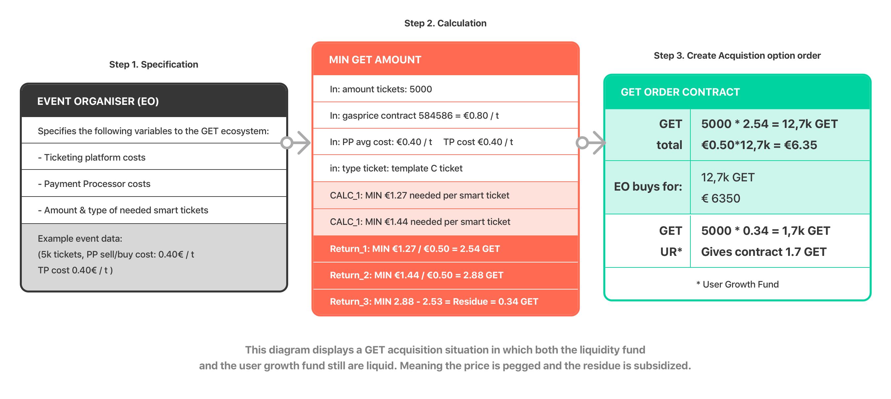

# 3.8.2 GET price on the open market

The oracle will ensure that the internal pricing of the GET will roughly follow the valuation of the GET price
 on the open markets/exchanges. In these markets the GET price is completely unrestricted in it’s valuation
 per GET. There is also no restriction in how the token is transferred from owner to owner outside of the GET
 Protocol. The GPO and the SF act as gatekeepers for GET entering and Ether leaving the protocol. Both
 mechanisms ensure actors within the protocol\(EOs and consumers holding smart tickets with GET attached to them\) with price/value stability. This mechanism also offers token holders on the open market a guaranteed
 exchange rate of at least €0.50 per GET\(settled in ETH\) when OMHs trade their GET for Ether with the SF.

_Figure 6: Diagram displaying a simplified overview of the GET acquisition process from the perspective of
 event organizers. The protocol is set up to ensure that the event organiser will be able to create a smart ticket without having to worry about currency fluctuations, non-liquid or stiff crypto markets._

