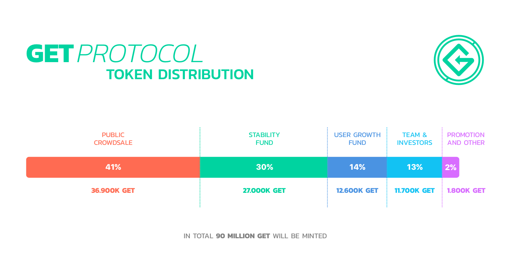

# 6.2 Distribution of GET

In total, up to 90 million GET will be minted via a smart contract system. The total number of GET Tokens
 minted will be divided into five different pools. The figure below shows this division\(take note: the percentages
 in the image shown below assume that the crowdsale will completely sell-out, meaning that all 90 million
 tokens will be minted\).

## Dynamic and static partitions. 

  
The amount of GET Tokens allocated to the ”SF” is fixed \(static\). This
 means that that regardless of the result of the crowdsale, 12.6 million GET will be minted into this fund by the
 crowdsale contract. The amount of GET to be allocated to the other pools are dynamic, the size of ”Public
 Exchange” depending on how many persons participate in the ICO and the size of the ”UGF” Pool and ”Team
 & Investors” Pool being calculated using the following formula: \(”GET exchanged in the Public Exchange ”
divided by 36,900\) times ”UGF” Pool maximum \(27,000\) \[OR\] ”Team & Investors” Pool maximum \(11,700\).
 See also the table below for further clarification:

| % of PE maximum exchanged | Size PE pool | Size UGF pool | Size SF pool |  Size T&E pool | Size P&O pool | Total |
| --- | --- | --- | --- | --- | --- | --- | --- | --- | --- |
| 100% | 36.900.000 | 27.000.000 | 12.600.000 | 11.700.000 | 1.800.000 | 90.000.000 |
| 90% | 33.210.000 | 24.300.000 | 12.600.000 | 10.530.000 | 1.620.000 | 82.260.000 |
| 80% | 29.520.000 | 21.600.000 | 12.600.000 | 9.360.000 | 1.440.000 | 74.520.000 |
| 60% | 22.140.000 | 16.200.000 | 12.600.000 | 7.020.000 | 1.080.000 | 59.040.000 |
| 50% | 18.450.000 | 13.500.000 | 12.600.000 | 5.850.000 | 900.000 | 51.300.000 |
| 40% | 14.760.000 | 10.800.000 | 12.600.000 | 4.680.000 | 720.000 | 43.560.000 |
| 30% | 11.070.000 | 8.100.000 | 12.600.000 | 3.510.000 | 540.000 | 35.820.000 |
| 23% | 8.560.800 | 6.264.000 | 12.600.000 | 2.714.400 | 417.600 | 30.556.800 |
| &lt;23% | 0.00 | 0.00 | 0.00 | 0.00 | 0.00 | 0.00 |

Table 14.

## Description of the partitions
. 

  
In the list below the different partitions are described as well as the maximum percentage of total maximum
 supply of 90 million GET is described.

* Public Exchange — up to 41% As the diagram above shows, up to 41% of the maximum amount of GET
   minted will be exchanged for ETH as part of the ICO. 
* User Growth Fund — up to 30% The UGF promotes protocol usage by rewarding both EO's and GU's
   for using the GET Protocol. See previous chapters about the role and function of the UGF. 
* GET Stability Fund — 14% STATIC The SF will act as a stabilizing buffer for EOs to acquire GET so
   they can use the GET for their events. 12,600,000 GET will be allocated to the SF, irrespective of the
   amount of GET exchanged in the public exchange. The SF acts as a siphon, and needs to replenish itself
   after any transaction with EO's, with the result that the SF will offer to exchange back GET into ETH
   from the open market against at least the guaranteed exchange rate. See previous chapters about the
   role and function of the UGF. The GET in stability fund will on net never enter circulating supply, as
   the stability fund will always buy the GET it provided to event organizers within the protocol back
   from the open market. 
 
* Team and advisers — up to 13% This partition of GET will be made available for the GET Foundation
   team and advisers. Approximately 6% will be transferred directly to team members and advisers, all
   with vesting contracts of at least 1 year.. The remainder will be held by the GET Foundation may at the
   sole discretion of the Foundation, be transferred exchanged with future team members and advisers if
   the Foundation deems this beneficial to the development and success of the GET Protocol. When GET is
   granted to team members and advisers, a standard lock-up period of 12 months applies. 
* Promotion and others —up to 2% The GET Tokens will be transferred to third parties in exchange
   for services in the field of marketing and as a bounty reward for quality control for the integrity and
   robustness of the code of the GET Protocol.

