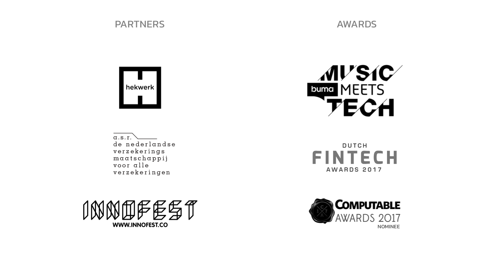

# 1.4.1 GUTS tickets

GUTS Tickets is a blockchain-based ticketing company founded in March 2016 by three Dutch entrepreneurs. The company employs eight developers and has won multiple innovation awards both in the Netherlands as well as throughout Europe. GUTS Tickets has partnered with some of the most famous comedians in the Netherlands to support the mission of truly transparent ticketing. Visit the GUTS website to view the events previously ticketed by GUTS, and use the Ethereum blockchain explorer to view the tickets on the chain. If you want to experience the future of event ticketing, check out our sandbox ticketing app and test it for yourself. 

Curious? Buy and sell a \(free\) smart ticket for a event via the GUTS ticketing application on our sandbox environment:  
[https://sandbox.guts.tickets/events](https://sandbox.guts.tickets/events)

Experience and partners of guts tickets.   
Over the last year of its existence, [GUTS Tickets](https://guts.tickets) has acquired both actual real-world experience in the business of selling tickets for events and, by running successful demos, has collected a set of important and influential stakeholders in the Dutch market, including Hekwerk Theatre Productions. This company organizes 800 theatre shows annually and has 20 major artists and comedians under management. [GUTS](https://guts.tickets) Tickets completed a successful pilot program with A-venue \(organizer of East Ville and Latin Village festivals\), which organizes several festivals that draw over 30,000 attendees. In addition, [GUTS](https://guts.tickets) Tickets has upcoming events in the pipeline in cooperation with major event organizer and partner Innofest.

